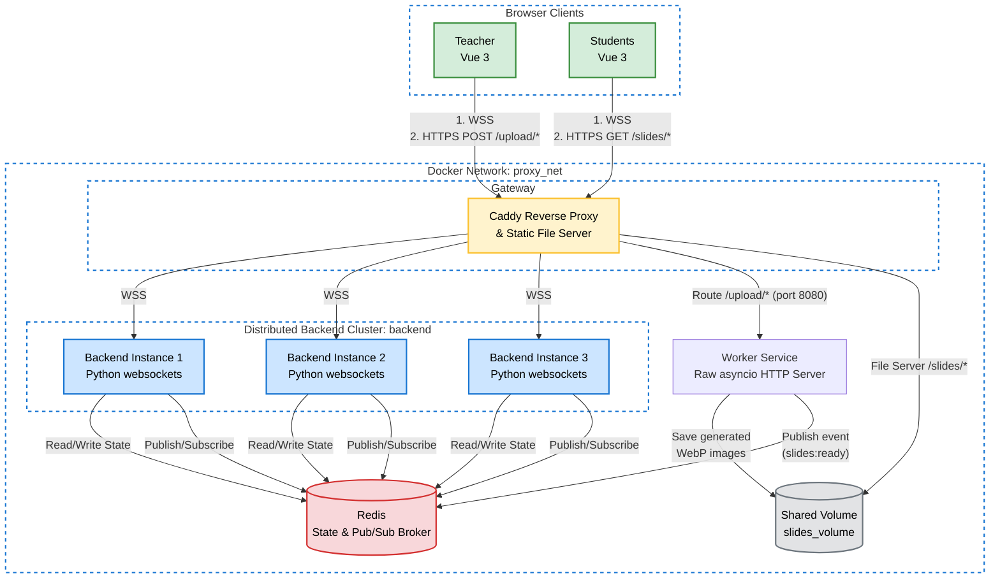

[](https://classroom.github.com/a/90Mprfp5)
# Network Programming - Final Project [G04]

## Anggota Kelompok
| Nama           | NRP        | Kelas     |
| ---            | ---        | ----------|
| Mohammed Lazuardi Yasfin               | 5025241139           | C          |
| Bintang Ilham Pabeta               | 5025241152           | C          |

## Link Youtube (Unlisted)
Link ditaruh di bawah ini
```
https://youtu.be/GuyuJVKOk5A
```

## Penjelasan Program

### Deskripsi Aplikasi

CarbonFreeClass adalah platform kelas interaktif real-time yang memungkinkan pengajar (host) untuk membagikan presentasi (PDF/PPTX) dan memberikan kuis interaktif (pop quiz) kepada siswa secara langsung. Aplikasi ini mengedepankan komunikasi dua arah berlatensi rendah, gamifikasi dengan live leaderboard, dan sistem broadcasting event kelas secara sinkron.

### Quick Start

#### Development Environment

```
docker compose -f compose.yaml -f compose.dev.yaml up --build
```

#### Production Environment

Pastikan `.env` yang sudah terisi sesuai `.env.example` berada di direktori yang sama.
```
docker compose -f compose.yaml -f compose.prod.yaml up --build
```

#### Multi-instance

```
docker compose -f compose.yaml -f compose.prod.yaml up --build --scale backend=3
```


### Arsitektur Sistem



Aplikasi ini menggunakan arsitektur terdistribusi yang terdiri dari beberapa node yang saling berkomunikasi melalui berbagai protokol jaringan:

- Frontend: Bertindak sebagai Client yang membuka koneksi persisten menggunakan WebSocket ke Backend, serta melakukan HTTP POST ke Worker untuk upload file dan HTTP GET ke Caddy untuk download slides.
- Backend: Bertindak sebagai WebSocket Server utama. Menangani ribuan koneksi konkuren, state management real-time (room, slides, leaderboard), serta melakukan broadcasting pesan.
- Worker: Bertindak sebagai Background Processor dan Custom HTTP Server. Bertugas menerima upload dokumen, mengubahnya menjadi gambar WebP secara asynchronous, lalu mengabari Backend via Redis.
- Redis: Bertindak sebagai In-Memory Database untuk state global dan sebagai Message Broker (Pub/Sub) untuk Inter-Process Communication (IPC) antar layanan.
- Caddy: Bertindak sebagai reverse proxy yang merutekan traffic dan load balancing WSS antara tiga backend instance.

### Implementasi

#### Komunikasi Full-Duplex secara Real-Time

Aplikasi menggunakan protokol WebSocket melalui pustaka `websockets` dan koneksi native WebSocket di frontend. Backend mengelola setiap koneksi dengan `WSConnectionManager`. Komponen ini bertanggung jawab untuk:

- Registrasi dan unregistrasi sesi dengan mapping `session_id` ke objek websocket.

- Mengimplementasikan beberapa connection reliability mechanism.

- Pembuatan sesi baru atau re-koneksi melalui metode `establish()` yang membaca frame pertama untuk mengambil `session_id` lama atau membuat token baru.

- Pengiriman pesan terstruktur dengan `send(event, session_id, data)` yang membungkus payload ke dalam WSMessage sebelum diubah ke JSON.


#### Concurrent Architecture

Backend dibangun di atas asyncio untuk menangani ribuan koneksi non‑blocking. Beberapa mekanisme konkurensi diterapkan:

- WebSocket server berjalan pada satu event loop, dengan handler async per koneksi.

- Rate limiting pada Redis menggunakan `RateLimitedRedis` yang membungkus perintah `execute` dengan `asyncio.Semaphore(max_concurrency=200)`. Ini mencegah terjadinya thundering herd saat banyak request simultan ke Redis.

- Worker service mengimplementasikan custom HTTP server di atas `asyncio.start_server` untuk menerima upload file. Worker mem-parsing header HTTP secara manual, membaca body, lalu menjalankan konversi PDF/PPTX ke WebP menggunakan sub‑proses pdftoppm dan cwebp secara concurrent.

#### Custom Protocol & Message Format

Di atas layer komunikasi WebSocket, aplikasi mendefinisikan Application-Level Protocol miliknya sendiri untuk menstandardisasi pertukaran pesan. Semua paket dibungkus dalam format envelope yang konsisten, yaitu 

```
{"event": "<prefix>:<action>", "data": { ... }}
```

Paket mentah yang masuk akan di-parse dan didistribusikan oleh komponen Event Router `WSEventRouter`. Pesan diteruskan ke handler spesifik (`ClassroomHandler`, `SlideHandler`, `QuizHandler`). Setiap payload divalidasi secara ketat menggunakan schema Pydantic untuk memastikan integritas tipe data sebelum diproses oleh service internal.

#### Connection Reliability

Backend mengimplementasikan beberapa mekanisme connection reliability yang terintegrasi di `WSConnectionManager` dan konfigurasi WebSocket server:

- Keep‑alive & deteksi half open: 
  Pada saat membuat WebSocket server, parameter `ping_interval=20` dan `ping_timeout=20` diberikan ke `websockets.serve`. Server secara otomatis mengirim ping setiap 20 detik. Apabila dalam 20 detik tidak ada pong, koneksi dianggap mati (TCP half‑open) dan ditutup guna mencegah kebocoran resource.

- Client reconnection: 
  Ketika klien (frontend) melakukan reconnect, ia mengirim frame pertama berisi `{"data": {"session_id": "xxx"}}`. Metode `establish()` di `WSConnectionManager` membaca frame tersebut, memverifikasi `session_id`, dan mengembalikan id yang sama (bukan membuat token baru). Setelah koneksi berhasil, klien mengirim event `classroom:sync` ke `ClassroomHandler`. Handler ini kemudian mengambil state ruang terbaru dari Redis dan mengirim balik `classroom:state_sync` yang berisi slide saat ini, total slide, daftar siswa, dan sebagainya.

- Duplicate login: 
  Jika sesi dengan `session_id` yang sama mencoba melakukan koneksi baru, `WSConnectionManager.register()` akan menutup koneksi lama dengan kode 4000 dan pesan `connection:replaced`, lalu menyimpan koneksi baru.

- Malformed packet mitigation:
  Setiap pesan yang masuk diproses oleh `process_raw_message()`. Jika decoding JSON gagal, fungsi `manager.record_error(session_id)` akan menambah counter error untuk sesi tersebut. Apabila counter mencapai `max_error_tolerance`, manager akan memanggil `kick()` yang menutup koneksi dengan kode 1008 (Policy Violation).

#### Multi-Instance Docker Deployment

Sistem dipaketkan menggunakan multi-stage Docker build dan dirancang dengan arsitektur terdistribusi:

- Caddy sebagai reverse proxy sekaligus load balancer WebSocket, mendistribusikan koneksi ke beberapa instance backend.

- Backend bersifat stateless. Seluruh data krusial (room state, TTL ruangan, leaderboard) disimpan secara terpusat di Redis.

- Inter‑Process Communication (IPC) menggunakan Redis Pub/Sub:

    - Worker setelah selesai konversi slide mempublish event `slides:ready` ke channel `room_events`.

    - Backend memiliki `RedisEventBus` yang melakukan subscribe ke channel yang sama dan memanggil `RoomEventHandler`. Event handler kemudian memperbarui total slides di Redis dan melakukan broadcast ke semua peserta ruang melalui `RoomBroadcastService`.

- Skalabilitas horizontal dengan `docker compose up --scale backend=3`, Caddy akan melakukan load balancing round‑robin dimana semua instance tetap sinkron karena membaca/menulis ke Redis yang sama.

## Screenshot Hasil


